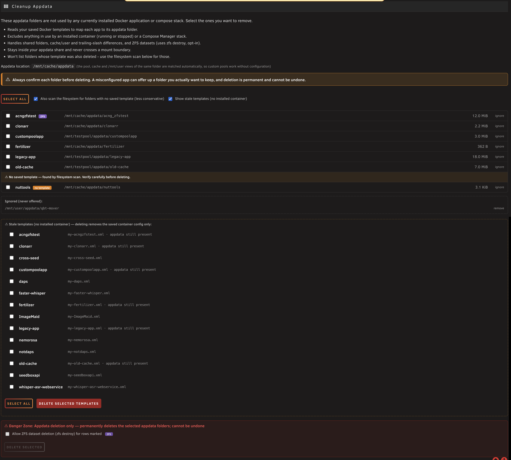

# Appdata Cleanup NG

Finds appdata folders left behind by removed Docker containers and lets you review
and delete them. A modernized revival of Andrew Zawadzki's (Squid) original
**CA Cleanup Appdata**, brought up to date for current Unraid.



> ⚠️ **Beta.** The core — orphan detection, delete-safety confinement, and
> build/install — is verified on current Unraid. A few paths can only be proven
> on hardware the author doesn't have; see [Status](#status--whats-still-being-verified).
> **Always review the folders offered before deleting — deletion is permanent.**

## Install

Unraid → **Plugins → Install Plugin**, and paste:

```
https://raw.githubusercontent.com/chodeus/appdata.cleanup.ng/main/plugins/appdata.cleanup.ng.plg
```

Then open **Settings → Cleanup Appdata**.

## Differences from Squid's original

- **Works on modern Unraid (6.4+/7.x).** The original no longer runs on current releases.
- **Safer deletes.** Confined to the appdata share, never crosses a mount
  boundary, and a backstop independent of what the browser submits.
- **ZFS-aware.** Dataset folders are removed with `zfs destroy` (opt-in), not a
  partial `rm`.
- **Custom pools.** Appdata on a non-standard pool (e.g. a dedicated cache pool)
  is matched automatically — no configuration.
- **Docker Compose aware.** Appdata used by Compose Manager stacks (including
  stopped/`down` stacks) is protected.
- **More to work with.** Folder sizes, an ignore list, an optional filesystem
  scan for template-less folders, a stale-template cleaner, and a one-click
  diagnostics export.

## Status — what's still being verified

This plugin is **beta**. Verified on the author's system:

- Orphan detection — removed-container templates **and** the optional filesystem scan
- Delete safety — appdata-share confinement, never crossing a mount boundary, and
  a backstop that doesn't trust what the browser submits (audited and unit-tested)
- Build / install / uninstall on current Unraid (6.4+/7.x)

Needs real-world confirmation — the author's box can't exercise these, so **reports are welcome**:

- **Non-standard appdata pools** — appdata on a secondary/custom pool. Path matching
  is unit-tested and simulated, but not yet confirmed on real hardware with a genuine
  second pool through the full scan → delete cycle.
- **ZFS dataset deletion** — dataset detection and `zfs destroy` (with automatic `-r`)
  are code-verified and probed non-destructively; a real dataset delete hasn't been run
  end-to-end.
- **Docker Compose stacks** — protection of compose-referenced appdata is tested against
  real and sample compose files; broad coverage of Compose Manager indirect files,
  `${VAR}`/`.env` resolution, and stopped (`down`) stacks wants more real setups.

If you hit any of the above, the one-click **diagnostics export** attached to a GitHub
issue is the most useful thing you can share.

---

Original *CA Cleanup Appdata* © 2015–2024 Andrew Zawadzki (Squid). Revived 2026 by chodeus.
